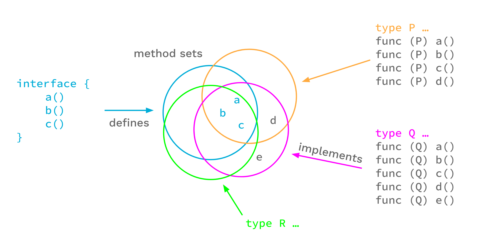

## 1 Go 泛型基本使用

### 1.1 类型参数（Type Parameters）
函数和类型现在允许有类型形参。类型形参列表与普通形参列表相似，只是它使用 `"[]"` 而不是 `"()"`。

看一个简单的例子：
类型参数出现在常规参数之前，参数列表使用中括号。其中 `T` 代表**类型参数**；`interface{int | float32}` 为**类型约束**（可去掉 `interface{}`，简写为 `int | float32`），类型 `T` 只能接收 `int`、`float32` 类型。
```go
func GMin[T interface{int | float32}](x, y T) T {
    if x < y {
        return x
    }
    return y
}
```

调用泛型方法时：
```go
// 方法1
f := GMin[int]  // 实例化
_ = f(1, 2)     // 调用

// 方法2
_ = GMin[int](1, 2) // 显示调用
_ = GMin(1, 2)      // 隐式调用
```

类型参数也可以和类型一起使用：
```go
type Tree[T interface{}] struct {
    left, right *Tree[T]
    value       T
}

func (t *Tree[T]) Lookup(x T) *Tree[T] { ... }

var stringTree Tree[string]
```

### 1.2 约束（Constraints）
通常，我们的泛型代码都希望类型参数满足某些要求，这些要求被称为约束 。

看一个例子：
```go
// 这个方法是无效的
// any 约束并没有任何可实现的操作（方法）
func Stringify[T any](s []T) (ret []string) {
    for _, v := range s {
        ret = append(ret, v.String()) // 编译错误
    }
    return ret
}
```

在此例中：
`any` 约束允许任何类型作为类型参数，并且只允许函数使用任何类型所允许的操作。其接口类型是空接口：`interface{}`，`s` 切片元素类型为 `T` ，并且 `T` 是 `any` 类型的，意味着 `T` 类型的实例并没有强制要求实现 `String()` 方法，即上面的代码将编译失败。

所以我们需要使用合适的约束作用于 `Stringify`，使得编译能够通过。自定义约束通过接口类型来定义。
- 约束定义
```go
type Stringer interface {
    String() string
}
```
- 约束使用
```go
func Stringify[T Stringer](s []T) (ret []string) {
    for _, v := range s {
        ret = append(ret, v.String())
    }
    return ret
}
```
- 多个类型参数和约束
```go
type Stringer interface {
    String() string
}

type Plusser interface {
    Plus(string) string
}

func ConcatTo[S Stringer, P Plusser](s []S, p []P) []string {
    r := make([]string, len(s))
    for i, v := range s {
        r[i] = p[i].Plus(v.String())
    }
    return r
}
```

### 1.3 约束类型

#### 1.3.1 任意类型约束
在 Go1.18 后，`interface{}` 的定义发生了变更，它可以表示**所有类型的集合**。
```go
// 所有类型的集合，并非空集。
// 类型约束中的空接口 interface{}，表示包含了所有类型的类型集，
// 并不是限定只能传入空接口 interface{}。
type Slice[T interface{}] []T

var s1 Slice[int]
var s2 Slice[string]
var s3 Slice[interface{}]
```

由于空接口 `interface{}` 的定义发生了变更，不能直接体现语义，所以 Go1.18 提供了新的关键词 `any`。且 Go 官方推荐所有使用空接口的地方都用 `any` 替换。
```go
type any = interface{}

// 上述泛型定义可改写
type Slice[T any] []T
```

#### 1.3.2 近似类型约束
在日常代码编写中，可能会自定义许多类型，例如：
```go
type MyInt int
type MyString string
```
此时就会出现以下问题。
```go
type Slice[T int | float32] []T

var s1 Slice[int]      // OK
// var s2 Slice[MyInt] // MyInt does not implement int (possibly missing ~ for int in constraint int)
```
`MyInt` 底层类型是 `int`，但其本身并不是 `int`，所以不能用于 `Slice[T int]` 的实例化。
​可以使用 `~int` 的写法，表示所有以 `int` 为底层类型的类型都可以用于实例化。
```go
type Slice[T ~int | float32] []T

type MyInt int
var s Slice[MyInt] // OK
```

#### 1.3.3 可比较类型约束
Go1.18 中内置了一个类型约束 `comparable` 约束，`comparable` 约束的类型集是所有可比较类型的集合（即可使用 == 和 != 的类型）。
```go
func Index[T comparable](s []T, x T) int {
    for i, v := range s {
        if v == x {
            return i
        }
    }
    return -1
}
```
`comparable` 也可以内嵌到其他接口类型中使用
```go
type ComparableHasher interface {
    comparable
    Hash() uintptr
}
```

这里要注意，虽然 comparable 为所有可比较类型的集合，但也有特例（空接口）。`interface{}` 类型是有可比较的，但它不属于 comparable 集合。因为 `interface{}` 比较是可能发生异常的，如下所示。
```go
// panic: runtime error: comparing uncomparable type func()
func main() {
    f1 := interface{}(func() {})
    f2 := interface{}(func() {})
    fmt.Println(f1 == f2)
}
```
所以如果 `interface{}` 属于 comparable 集合，就将出现编译期正常，运行期出现异常的情况，这就违反了泛型编程的初衷。

#### 1.3.4 联合约束
联合约束，通过一系列 `"|"` 分隔约束元素。例如：`int | float32` 或 `~int8 | ~int16 | ~int32 | ~int64`。并集元素的类型集是序列中每个元素的类型集的并集。联合中列出的元素必须全部不同。这里给所有有符号的数字类型添加一个通用的求和方法，如下：
```go
type SignedInteger interface {
    ~int | ~int8 | ~int16 | ~int32 | ~int64
}

func SumOfSignedInteger[T SignedInteger](integers []SignedInteger) SignedInteger {
    sum := 0
    for i := range integers {
        sum += i
    }
    return sum
}
```

#### 1.3.5 交集约束
接口可以不止写一行，如果一个接口有多行类型定义，那么取他们之间的**交集**。
```go
type AllInt interface {
    ~int | ~int8 | ~int16 | ~int32 | ~int64 | ~uint | ~uint8 | ~uint16 | ~uint32 | ~uint32
}

type Uint interface {
    ~uint | ~uint8 | ~uint16 | ~uint32 | ~uint64
}

type A interface { // 接口A代表的类型集是 AllInt 和 Uint 的交集
    AllInt
    Uint
}

type B interface { // 接口B代表的类型集是 AllInt 和 ~int 的交集
    AllInt
    ~int
}
```
上面这个例子中：
- 接口 A 代表的是 AllInt 与 Uint 的 交集，即 `~uint | ~uint8 | ~uint16 | ~uint32 | ~uint64`
- 接口 B 代表的则是 AllInt 和 ~int 的交集，即 `~int`

#### 1.3.6 空集约束
当多个类型的交集如下面 Bad 这样为空的时候， Bad 这个接口代表的类型集为一个空集：
```go
// 类型 int 和 float32 没有相交的类型，所以接口 Bad 代表的类型集为空
type Bad interface {
    int
    float32 
} 
```

### 1.4 类型集（Type sets）
上面的例子中，我们学习到了一种接口的全新写法，而这种写法在 Go1.18 之前是不存在的。在 Go1.18 之前，Go 官方对接口（interface） 的定义是：接口是一个方法集（method set）。

就如下面这个代码一样， Example 接口定义了一个接口（方法集），这个集合中包含了 a()、b() 和 c() 这三个方法。所有同时定义了这三种方法的类型被视为实现了这一接口。
```go
type Example interface {
    a()
    b()
    c()
}
```



但是，我们如果换一个角度来重新思考上面这个接口的话，会发现接口的定义实际上还能这样理解：我们可以把 Example 接口看成代表了一个类型的集合，所有实现了 a()、b() 和 c() 这三个方法的类型都在接口代表的类型集合当中。通过换个角度看待接口，在我们眼中接口的定义就从方法集（method set） 变为了类型集（type set）。而Go1.18开始就是依据这一点将接口的定义正式更改为了类型集（Type set）。


### 1.5 类型推断（Type inference）
在许多情况下，可以使用类型推断来避免必须显式写出部分或全部类型参数。可以对函数调用使用的参数类型推断从非类型参数的类型中推断出类型参数。开发者可以使用约束类型推断从已知类型参数中推断出未知类型参数。如下所示：
```go
func Map[F, T any](s []F, f func(F) T) []T { 
    //... 
}

func E () {
    var s []int
    f := func(i int) int64 { return int64(i) }
    var r []int64
    // 标注两个类型
    r = Map[int, int64](s, f)
    // 只指定第一个类型参数
    r = Map[int](s, f)
   // 不指定任何类型参数，并让两者都被推断。
    r = Map(s, f)
}
```

## 2 Go 泛型示例

### 2.1 map/filter/reduce
- map
```go
// Map 将 []T1 通过 f 映射为 []T2
func Map[T1, T2 any](s1 []T1, f func(T1) T2) []T2 {
	s2 := make([]T2, len(s1))
	for i, v := range s1 {
		s2[i] = f(v)
	}
	return s2
}

var intSlice = []int{1, 2, 3, 4, 5}
var stringSlice = Map[int, string](intSlice, func(i int) string { return strconv.Itoa(i) })
```
- filter
```go
// Filter 通过给定的 Filter 函数 f 来过滤一个 slice
func Filter[T any](s []T, f func(T) bool) []T {
	r := make([]T, 0)
	for _, v := range s {
		if !f(v) {
			r = append(r, v)
		}
	}
	return r
}

var s1 = []int{1, 2, 3, 4, 5}
var s2 = Filter[int](s1, func(i int) bool { return i > 0 })
```
- reduce
```go
// Reduce 使用还原函数 f 将 []T1 还原为单个值
func Reduce[T1, T2 any](s []T1, init T2, f func(T2, T1) T2) T2 {
	r := init
	for _, v := range s {
		r = f(r, v)
	}
	return r
}

var s1 = []int{1, 2, 3, 4, 5}
var sum = Reduce[int, int](s1, 0, func(i1, i2 int) int { return i1 + i2 })
```

### 2.2 sort
```go
// sliceFn is an internal type that implements sort.Interface.
// The Less method calls the cmp field.
type sliceFn[T any] struct {
	s   []T
	cmp func(T, T) bool
}

func (s sliceFn[T]) Len() int           { return len(s.s) }
func (s sliceFn[T]) Less(i, j int) bool { return s.cmp(s.s[i], s.s[j]) }
func (s sliceFn[T]) Swap(i, j int)      { s.s[i], s.s[j] = s.s[j], s.s[i] }

// SliceFn sorts the slice s according to the function cmp.
func SliceFn[T any](s []T, cmp func(T, T) bool) {
	sort.Sort(sliceFn[T]{s, cmp})
}
```
调用示例：
```go
var s []*Person
// ...
sort.SliceFn(s, func(p1, p2 *Person) bool { return p1.Name < p2.Name })
```

### 2.3 指针方法
首先我们先看一个例子：
```go
// Setter 是一个类型约束
// 实现一个从字符串中设置值的 Set 方法。
type Setter interface {
	Set(string)
}

// FromStrings 接受一个字符串切片并返回一个 T 切片，
// 调用 Set 方法来设置每个返回值。
func FromStrings[T Setter](s []string) []T {
    result := make([]T, len(s))
    for i, v := range s {
        result[i].Set(v)
    }
    return result
}

//--------------------构建调用示例-----------------------

// 定义一个可设置的 int
type Settable int

// 从字符串中设置 *p 的值
func (p *Settable) Set(s string) {
    i, _ := strconv.Atoi(s)
    *p = Settable(i)
}

func F() {
    FromStrings[Settable]([]string{"1", "2"}) // Error: Settable does not implement Setter 
}
```
这里的目标是使用 `FromStrings()` 获得一个切片，但是此处会编译错误，问题是 `FromStrings()` 需要一个有 `Set(string)` 方法的类型。函数 F 试图用转换返回类型为 Settable，但 Settable 没有 Set 方法。有 Set 方法的类型是 *Settable，那在调用时将返回类型改变为 *Settable。
```go
func F() {
	FromStrings[*Settable]([]string{"1", "2"}) 
}
```
当前代码可编译，但运行时会 `panic`，原因是 `FromStrings()` 创建了一个切片，切片的类型为 []*Settable（切片中的元素全部被初始化为 nil）。`FromStrings()` 执行 `result[i].Set(v)` 就会出现 nil 来调用 Set 方法，从而 `panic`。

因此我们的代码做如下修改：
```go
type Setter[T any] interface {
    *T
    Set(string)
}

func FromStrings[T Setter, P Setter[T]](s []string) []T {
    result := make([]T, len(s))
    for i, v := range s {
        x := P(&result[i])
        x.Set(v)
    }
    return result
}

func F() {
   nums := FromStrings2[Settable, *Settable]([]string{ "1" , "2" })
   // 自动类型推导
   nums =  FromStrings2[Settable]([]string{"1", "2"})
}
```
最终通过编译，并运行成功。

## 3 Go 泛型限制

不支持匿名对象、函数泛型
特化
元编程
柯里化
非类型参数
运算符方法
变长类型参数

### 3.1 类型集限制
Go 类型集设计不完备，存在无法表示的类型集约束。例如，方法类型集无法与其他类型集联合，如下所示：
```go
type BadConstraints interface {
    string | fmt.Stringer // Error:cannot use fmt.Stringer in union (fmt.Stringer contains methods)
}
```

### 3.2 无法辨认基础类型
在类型约束中可以用 `"~"` 的语法约束所有基础类型为 T，如下所示：
```go
// type BadConstraints interface {
//     string | fmt.Stringer 
// }

type Stringish interface {
    ~string
}

func ToString[T Stringish](s T) string {
    switch x := any(s).(type) {
    case string:
        return x
    case fmt.Stringer:
        return x.String()
    default:
        panic("impossible")
    }
}

type S string

func F() {
    ToString(S("x")) // panic
}
```
以上代码会 panic，因为 S 不是 string 类型。Go 不支持将一个类型参数断言出它的底层类型。

### 3.3 不支持特化
Go 特化：尝试编写以下代码
```go
type List[T any] struct {
    next    *List[T]
    value   T
}

func (l *List[T]) Len() int {
    return 0
}

func (l *List[T]) Length() int {
    return 0
}

// type parameter int any
func (l *List[int]) Length() int { // Error: method Length already declared for type List[T any] struct{next *List[T]; value T}
    return 1 // Error: cannot use 1 (untyped int constant) as int value in return statement
}
```
编译出错，通过错误信息，我们可以发现这里的 int 并不是内建的整数类型，而是一个类型参数的名称，等价于我们常用的 T、K、V。这里我们使用 int 作为类型参数的名称很有迷惑性。不仅如此，Go 语言也没有函数重载的概念，因此无法实现泛型特例化。

C++ 特化：
```cpp
template <class T>
class MyList {
private:
    MyList<T>* next;
    T value;

public:
    int len() { 
        return 0;
    }

    int length() {
        return 0;
    }
};

// 特化
template<>
class MyList<char> {
public:
    int len() { 
        return 1;
    }

    int length() {
        return 1;
    }
};

void F() {
    MyList<int> l1; 
    std::cout << l1.len() << std::endl; // 0
    MyList<char> l2;
    std::cout << l2.len() << std::endl; // 1
}
```

### 3.4 不支持模板元编程
Go 泛型不支持模板元编程。

C++ 模板元编程：
```cpp
template <bool b>
struct If {
};

// 全特化
template <>
struct If<true> {
    static void print() {
        std::cout << "true" << std::endl;
    }
};

template <>
struct If<false> {
    static void print() {
        std::cout << "false" << std::endl;
    }
};

void F() {
    If<true>::print();  // true
    If<false>::print(); // false
}
```

### 3.5 不支持非类型参数
Go：无法定义非类型参数模板，T 为类型参数名称。
```go
func test1[T int]() {
    fmt.Println(T) // Error: T (type) is not an expression
}

func F() {
    test1[1]() // Error: 1 is not a type
}
```

C++：非类型参数模板
```cpp
// int
template <int len>
void test1() {
    std::cout << len << std::endl;
}

// 函数指针
template <void(*func)()>
void test2(){
    func();
}

void print() {
    std::cout << "hello" << std::endl;
}

void F() {
    test1<11>();    // 11
    test2<print>(); // hello
}
```

### 3.6 不支持方法类型参数
Go 不支持在一个类型的方法上添加类型参数，如下所示：
```go
type MyType struct {
}

func (m MyType) show[T ~int](i T) {// Error: method must have no type parameters
    fmt.Println(i)
}

func F() {
    var i MyType
    i.show[int](2) // Error
}
```

C++方法类型参数：
```cpp
class MyType {
public:
    template <typename T>
    void show(T i);
};

template <typename T>
void MyType::show(T i) {
    std::cout << i << std::endl;
}

void F() {
    MyType x;
    x.show<int>(2); // 2
}
```

### 3.7 不支持可变长类型参数
Go 不支持可变长类型参数模板：
```go
func print[T ...interface{ ~int }]() { // Error: invalid use of '...'
    // ...
}
```

C++ 可变长类型参数模板：
```cpp
// 递归出口
void print() {
    std::cout << std::endl;
}

template<typename FirstArg, typename ... Args>
void print(const FirstArg& th, const Args&... args) {
    std::cout << th << " ";
    print(args...);
}

int main() {
    print("abc", 1, 3.1f); // abc 1 3.1
    return 0;
}
```

### 3.8 不支持半实例化
Go 无法部分实例化泛型函数或类型。所有类型参数必须在实例化时显式传递或推断。

C++ 半实例化模板：
```cpp
template<int I, int J, class T> 
class X {};  // #1

template<int I, int J>
class X<I, J, int> {}; //#2

template<int I>
class X<I, I, int> {}; //#3

template<int I, int J> 
void f1(X<I, J, int>);  //#A
template<int I>
void f2(X<I, I, int>);  //#B
```
模板 #1 是主模板，#2 和 #3 是半实例化的模板，其中 #3 的实例化程度要比 #2 要高。所以，函数 #B使用的是模板 #3 而不是模板 #2。函数 #A 使用模板 #2。

## 4 总结 
Go 泛型特点总结如下：

- 函数和类型可以有类型参数，这些参数是使用约束定义的，也就是接口类型。

- 约束描述类型参数所需的方法和允许的类型。

- 约束描述类型参数允许的方法和操作。

- 当调用带有类型形参的函数时，类型推断通常允许省略类型实参。

当前 Go 泛型限制比较大，只能实现一些简单的泛型机制，无法实现一些高级的泛型机制。如：非类型参数、变长类型参数、操作符方法、特化、模板元编程或其他任何形式的编译时编程等。


<a href="https://github.com/golang/proposal/blob/master/design/43651-type-parameters.md"> 更多详细内容请参考官方提案 </a>